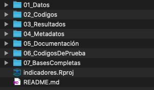

background-image: url(Imagenes/bg.png)
background-size: contain
class: center, middle

<style>

@import url('https://fonts.googleapis.com/css2?family=Poppins:wght@800&display=swap');
@import url('https://fonts.googleapis.com/css2?family=Poppins&display=swap');

p {
  font-family:Poppins;
  text-align:justify;
}

p.centrado {
  font-family:Poppins;
  text-align:center;
}

</style>

<br><br><br><br><br>

<h1 id = "r-y-rstudio-" style = "color:white; font-family:Poppins-Bold;">R y RStudio. </h1>
<h3 id = "r-y-rstudio-" style = "color:white; font-family:Poppins-Bold;">Temas generales. </h1>

<br><br>
<p class = 'centrado'>
<b>Jorge Juvenal Campos Ferreira.</b> <br>
Visualización de datos en Shiny.<br>
CIDE-LNPP<br>
Noviembre, 2021. 
</p>

```{r setup, include=FALSE}
options(htmltools.dir.version = FALSE)
```

---

## R &nbsp;&nbsp; `base` &nbsp;&nbsp; y &nbsp;&nbsp;`tidyverse`.

R tiene, en mi experiencia, tres grandes sabores (o _dialectos_) que podemos elegir para sacarle el jugo a nuestras tablas y bases de datos. 

El primero de ellos es `base`, el cual es un enfoque basado en programación funcional, mientras que el segundo es el que aprovecha la filosofía de los paquetes del `tidyverse`, tomando elementos de la programación orientada a objetos. 

Otro es el `data.table`, el cual es menos popular, pero es bastante rápido y eficiente en uso de memoria. Si quieres saber más de el te recomiendo los siguientes artículos: 

* https://wetlandscapes.com/blog/a-comparison-of-r-dialects/

* https://stackoverflow.com/questions/21435339/data-table-vs-dplyr-can-one-do-something-well-the-other-cant-or-does-poorly

---
background-image: url(Imagenes/intro_tidyverse.png)
background-size: 900px
---
background-image: url(Imagenes/tidyverse_logo.png)
background-size: 100px
background-position: 96% 3%

## Tidyverse

El `tidyverse` es un conjunto de paquetes de R diseñado para su uso en ciencia de datos. Todos estos paquetes comparten un diseño y una filosofía, gramática y estructura de datos común. Estos paquetes son: 

<p style='text-align:center;'></p>

---
background-image: url(Imagenes/tidyverse_logo.png)
background-size: 100px
background-position: 96% 3%

## Tidyverse

El `tidyverse` es un conjunto de paquetes de R diseñado para su uso en ciencia de datos. 

Todos estos paquetes comparten un diseño y una filosofía, gramática y estructura de datos común. Estos paquetes son: 

* `dplyr`, para el manejo de bases de datos. Incluye los verbos `filter()`, `select()`, `mutate()`, `group_by()`, `summarise()` y `arrange()` para resolver nuestros problemas.

* `ggplot2`, para la elaboración de gráficas a partir de la *gramática de las gráficas*. 

* `readr`, para leer archivos tabulares de manera sencilla.

* `tibble`, formato mejorado para manejar `data.frames` y tablas.

---
background-image: url(Imagenes/tidyverse_logo.png)
background-size: 100px
background-position: 96% 3%

## Tidyverse

* `tidyr`, para añadir funciones de cambio de forma de las tablas y tibbles. 

* `purr`, para añadir el enfoque de la programación funcional.

---
background-image: url(Imagenes/intro_pipa_1.png)
background-size: 900px

---
background-image: url(Imagenes/intro_pipa_2.png)
background-size: 900px

---
background-image: url(Imagenes/intro_pipa_3.png)
background-size: 900px

---
background-image: url(Imagenes/intro_pipa_4.png)
background-size: 900px

---
background-image: url(Imagenes/tidyverse_logo.png)
background-size: 100px
background-position: 96% 3%

## Pipa en el tidyverse (`%>%`)

Igualmente, el `tidyverse` incluye el símbolo de la pipa, `%>%`, el cual es un operador de concatenación entre distintas instrucciones de R y nos sirve para pegar código de manera sencilla.  

**Un ejemplo con código de verdad: **

```{r eval = F}
bd %>% 
  filter(var_1 == 1) %>% 
  group_by(var_agrupadora) %>% 
  summarise(media = mean(var_respuesta)) %>% 
  mutate(Porcentaje = media/sum(media)) %>% 
  ungroup() %>% 
  pivot_longer(cols = c(var_agrupadora, Porcentaje)) %>% 
  do(tidy(lm(var_respuesta ~ var_agrupadora + Porcentaje,data = .)))
```

---
background-image: url(Imagenes/verbos_tidyverse.png)
background-size: 900px

---
background-image: url(Imagenes/Rlogo.png)
background-size: 100px
background-position: 96% 3%

## Instalar librerias/paquetes. 

Al instalar R y RStudio, tenemos precargadas las librerias `base`, `datasets`, `graphics`, `grDevices`, `methods`, `stats` y `utils`.

En R, utilizamos librerías externas para añadir más funcionalidades a nuestros códigos o utilizar funciones precargadas que eviten que tengamos que partir desde cero en nuestra programación. 

Si queremos instalar una libreria nueva, tenemos las siguientes opciones: 

a) **Descargarlas con el instalador de paquetes de RStudio**

b) **Utilizar la función `install.packages()`** si el paquete esta en el CRAN (Asistente de la forma de arriba).

c) **Usar la librería** `devtools` **y la función** `devtools::install_github()` para descargar paquetes que no estan en el CRAN desde Github u otra ubicación externa (_para paquetes que no pasan las reglas del CRAN o para betas de desarrollador_).

---
background-image: url(Imagenes/Rlogo.png)
background-size: 100px
background-position: 96% 3%

## Instalar librerias/paquetes. 

d) c) Igualmente, contamos con la librería `remotes` para llevar a cabo instalaciones como las que se pueden realizar con `devtools`.

e) El repositorio `Bioconductor`, el cual es un repositorio que almacena paquetes, datos y funciones especializadas en el análisis de conjuntos de datos biológicos. Para instalar paquetes de esta librería, utilizamos el paquete `BiocManager` y la función `BiocManager::install()`.

---
background-image: url(Imagenes/Rlogo.png)
background-size: 100px
background-position: 96% 3%

## NOTA: ¿Qué es el CRAN?

El CRAN (*Comprehensive R Archive Network*) es un **conjunto de sitios que almacenan material identico, consistente de distribuciones de R, extensiones, documentación para R y archivos binarios (las paqueterias).** 
**Los paquetes que se encuentran en el CRAN deben cumplir criterios de calidad de publicación**, 

* no ser triviales, 

* ser actualizados frecuentemente, 

* no incluir virus ni código ejecutable por si mismo, 

* deben incluir documentación, 

---
background-image: url(Imagenes/Rlogo.png)
background-size: 100px
background-position: 96% 3%

## NOTA: ¿Qué es el CRAN?

* deben funcionar en al menos dos de las grandes plataformas de computación (como Windows, Mac y Linux), 

* no deben mandar información a terceros sin nuestra autorización, entre otras características que se pueden revisar en este enlace: https://cran.r-project.org/web/packages/policies.html

.footnote[Visita https://CRAN.R-project.org/ para mayor información.]

---

## Activar librerias.

Al instalar R y RStudio, tenemos precargadas las librerias `base`, `datasets`, `graphics`, `grDevices`, `methods`, `stats` y `utils`. Si queremos instalar otras librerías para añadir más funcionalidades a nuestros códigos o utilizar funciones precargadas que eviten que tengamos que partir desde cero en nuestra programación. 

**Nota: el paquete base no se puede desactivar, o mandará un mensaje de error.**

```
Error in detach("package:base", unload = TRUE) : 
  detaching "package:base" is not allowed
```

---

### Activar o llamar librerías.

Para llamar librerias, utilizaremos la función `library()`, la cual nos sirve para cargar paquetes de R previamente instalados en nuestra computadora. 

Esta función generalmente se usa sin argumentos. Otra opción es usar la función `require()`, que hace exactamente lo mismo. 

```{r eval=FALSE}

# El argumento quietly abre la libreria sin mandar mensajes de cache o Error 
library(tidyverse, quietly = TRUE)

# Salvo que sean mensajes escritos por el Autor
library(sf, quietly = TRUE)

# La funcion require() tiene la misma funcion que library()
require(leaflet)

# La función detach() desactiva la libreria de nuestra lista de librerias activadas
detach("package:leaflet", unload = TRUE)
```

---

## Nota: Alternativa usando la librería &nbsp; `pacman`.

`pacman` es un paquete que nos permite llamar otros paquetes utilizando la función `pacman::p_load()`, la cual **llama a los paquetes de la misma manera que `library()` y `require()` si estan instalados, y los instala si no lo estan**. La función recibe como argumentos la lista de los nombres de las librerias, pudiendo cargar multiples librerias en una sola línea de código. 

Esta función es **buena para garantizar que la persona que está corriendo nuestros códigos tenga las librerias instaladas y actualizadas**, sin embargo, esta función <b style = 'color:red;'>presenta varios conflictos con las aplicaciones `shiny`, por lo que descartaremos su uso</b>. 

Otra complicación que presenta esta función es que **es significativamente más lenta que las funciones `library()` y `require()`**, y dado que priorizaremos la velocidad de procesamiento siempre que sea posible, **evitaremos usar funciones que sean ineficientes.**

---
background-image: url(Imagenes/Rlogo.png)
background-size: 100px
background-position: 96% 3%

## Repaso de R base. Operador `$` y `<-`.

El operador `$` nos sirve para acceder a los componentes de un objeto, mientras que el operador `<-` nos permite asignarle un nombre a un objeto y guardarlo en memoria dentro del ambiente. Usados conjutamente, el operador `$` y `<-` nos permiten crear nuevos objetos y variables. 

**Ejemplo.**

Leamos una base de datos de la libreria `Histdata` y probemos los indicadores: 

### GaltonFamilies {`HistData`}

_Galton's data on the heights of parents and their children, by child._

---
background-image: url(Imagenes/Rlogo.png)
background-size: 100px
background-position: 96% 3%

## Description

_This data set lists the individual observations for 934 children in 205 families on which Galton (1886) based his cross-tabulation._

_In addition to the question of the relation between heights of parents and their offspring, for which this data is mainly famous, Galton had another purpose which the data in this form allows to address: Does marriage selection indicate a relationship between the heights of husbands and wives, a topic he called assortative mating? Keen [p. 297-298](2010) provides a brief discussion of this topic._

```{r, eval = FALSE}
# Instalamos la libreria: 
install.packages("HistData")
```

---

```{r}
# Activamos la libreria dentro de ambiente: 
library(HistData)

# Llamamos a la base de datos: 
# Base de datos de datos de la familia Galton 
bd <- GaltonFamilies

# Accedemos a la variable 
# * En este caso, accedemos a la variable (columna) childHeight de la base de datos bd. 
bd$childHeight

```

---

```{r}
# Variable asignacion 
cuatro <- 4
# * En este caso, llenamos un objeto en la memoria con un 4, y lo guardamos bajo el nombre de `cuatro` dentro de nuestro ambiente, para poder usarlo posteriormente
cuatro + cuatro
cuatro * 3

# Ahora, con una base de datos 
bd$pais <- "England"

# * En este caso, lo que estamos haciendo es generar un 
# objeto dentro de obtro objeto, el cual va a repetir la 
# palabra "England" las veces que mida el objeto `bd`. 

# * En el caso anterior, podemos generar una nueva
# columna con un valor unico que se va a repetir el numero 
# de renglones que tenga la tabla original, o crear una 
# columna con un vector que tenga el mismo numero de 
# renglones que el original. No se permiten numeros 
# intermedios ni mayores entre 1 y N. 

```

---
background-image: url(Imagenes/Rlogo.png)
background-size: 100px
background-position: 96% 3%

## Repaso de R Base. Subseteo con `[]`.

Dada la tabla (por ejemplo) `palmerpenguins::penguins`

```{r eval = FALSE}
# Guardamos en otro objeto
bd <- palmerpenguins::penguins

# Nos quedamos con el primer renglon
bd[1,]

# Nos quedamos con la primer columna
bd[,1]

# Nos quedamos con la columna species
bd[,"species"]

# Nos quedamos con los renglones 1,2,3 y 64
bd[c(1,2,3,64),]

# Nos quedamos con los renglones de los pinguinos 
# de la isla Torgersen
bd[bd$island == "Torgersen",]

```

---
background-image: url(Imagenes/Rlogo.png)
background-size: 100px
background-position: 96% 3%

## Archivos nativos de R

Al trabajar con R y RStudio, generamos cuatro tipos de archivos nativos de R, estos son los siguientes: 


* `*.Rproj`, 

* `*.RData`, 

* `*.R` y 

* `*.rds`.

---
background-image: url(Imagenes/rproj.png)
background-size: 100px
background-position: 96% 3%

## `*.Rproj`, **Proyectos de R.**  

Los archivos de proyectos de R mantienen nuestro trabajo dividido en múltiples contextos, teniendo asociados un **único directorio de trabajo**, **espacio de trabajo**, **historial** y **documento fuente**. 

Podemos crear Proyectos en nuevos directorios desde RStudio (_File > New Project..._) o copiandolos y pegandolos desde otros directorios.

---
background-image: url(Imagenes/rproj.png)
background-size: 100px
background-position: 96% 3%

## `*.Rproj`, **Proyectos de R.**  

Una vez que abrimos un proyecto, se inician las siguientes acciones: 

1. Se **inicia una nueva sesión** de R. 

2. Se **cargan los datos guardados** en el archivo `*.RData`.

3. Se **carga el historial de proyecto**, almacenado en el `*.RHistory`. 

4. **Se toma la dirección actual del archivo como la dirección base del nuevo directorio de trabajo.**

5. **Los archivos que hayamos editado previamente se restauran** en las pestañas en las que estaban la última vez que los editamos. 

6. **Se restauran las opciones pre-marcadas** desde la última sesión en RStudio. 

---
background-image: url(Imagenes/rproj.png)
background-size: 100px
background-position: 96% 3%

## `*.Rproj`, **Proyectos de R.**  

La utilidad de trabajar con proyectos, _en mi experiencia_, la siguiente: 

* **Reproducibilidad:** Al mantener las direcciones de todos los archivos de manera relativa a este proyecto, es fácil reproducir los análisis nada más abriendo este archivo. 

_Esto es muy útil para cuando estamos revisando tareas y es lo **primero** que le debes enseñar a tus alumnos antes de mandarles la tarea_. 

Otra ventaja es el orden que tenemos cuando estamos subiendo repositorios a Github con la intención de que alguien más los descargue, para evitarle modificar las rutas de los archivos.

Estos proyectos hacen que ya no sea necesario el configurar el directorio de trabajo con rutas absolutas con la función `setwd()`. 

Una alternativa al uso de proyectos son las funciones de la librería `here`, la cual fija la carpeta de trabajo en la carpeta en la cual se encuentra el script ejecutado. 

---
background-image: url(Imagenes/advertencia.png)
background-size: 100%
background-position: 50% 40%

.footnote[Fuente: https://www.tidyverse.org/blog/2017/12/workflow-vs-script/ de Jenny Brian]

---
background-image: url(Imagenes/rproj.png)
background-size: 100px
background-position: 96% 3%

## `*.Rproj`, **Proyectos de R.**  

**Orden: ** Trabajar con proyectos separados nos permite abrir scripts y bases de datos relacionados con un tema de trabajo en partícular. 

_Cuando no tenemos esta precaución, nos vamos a enfrentar a una pila de scripts abiertos con el trabajo de la semana pasada, y de la antepasada, y de fechas que no recordamos._

.footnote[Para mayor información checar: https://support.rstudio.com/hc/en-us/articles/200526207-Using-Projects]

Vale la pena darse la vuelta por las opciones de proyecto, accesibles en _Herramientas >> Opciones Globales >> General_

---
background-image: url(Imagenes/RData.png)
background-size: 100px
background-position: 96% 3%

## `*.RData`, **Datos de R**. 

Los archivos `*.RData` nos permiten almacenar múltiples objetos dentro de un sólo archivo. Estos archivos son específicos de R, y no son compatibles con ningún otro lenguaje de programación. 

**Ejemplo:** _Imagina que tenemos dos bases de datos y un análisis de prueba de medias, el cual queremos guardar para trabajarlo después o queremos traspasarselo a otros colegas que utilicen igualmente RStudio. Esto lo podríamos hacer con el siguiente código._

```{r, eval = FALSE}
# Guardando objetos de R en un solo archivo. 
save(c1.df, c2.df, c1.htest, 
     file = "study1.RData")
```

---


---
background-image: url(Imagenes/RData.png)
background-size: 100px
background-position: 96% 3%

## `*.RData`, **Datos de R**. 

Para desempaquetar los objetos de un archivo `*.RData`, utilizamos la función `load()`. Otra opción es que arrastremos el archivo hasta nuestra ventana de RStudio y el programa entenderá que queremos desempaquetarlo. 

```{r, eval = FALSE}
# Abriendo los archivos  
load(file = "study1.RData")
```

---
background-image: url(Imagenes/RLogo.png)
background-size: 100px
background-position: 96% 3%

## `*.R`, **Scripts de R** 

Scripts escritos en R. Estos archivos contienen los comandos o instrucciones necesarios para que el lenguaje de programación R lleve a cabo acciones específicas. 

Son los archivos donde guardamos nuestros programas. Consisten principalmente de texto plano guardado en una extensión elegante (puedes comprobar esto si abres un archivo `.R` con el bloc de notas). 

---
background-image: url(Imagenes/RLogo.png)
background-size: 100px
background-position: 96% 3%

## Notas sobre los archivos `.R`

Estos archivos se guardan con una codificación especial, o _encoding_, que viene siendo un conjunto de caracteres especiales. _En caso de que este conjunto no coincida con el conjunto configurado en RStudio, se obtendrán traducciones en caracteres muy extraños._ Esto se puede solucionar reabriendo el archivo desde **_Archivo >> Reabrir con Encoding_**. 

**Otra cosa a tomar en cuenta** es que puedes ejecutar un script desde otro script utilizando la función `source()`. Esto es útil si queremos tener las funciones aisladas de los análisis o si nuestro análisis involucra tanto código que conviene tenerlo en archivos separados. 


---
background-image: url(Imagenes/RLogo.png)
background-size: 100px
background-position: 96% 3%

## Notas sobre los archivos `.R`

* No es forzoso abrirlos desde RStudio. 

Estos archivos se pueden abrir directo de la consola de R y ejecutarse directamente, o se pueden abrir desde la terminal de la computadora. 

En Mac y Linux, podemos incluso programar que estos archivos se ejecuten a determinados momentos del día en segundo plano. (Revisar **Crontab**).

* El equivalente en Python a los `*.R` son los archivos `*.py`. 

---
background-image: url(Imagenes/rds_logo.png)
background-size: 100px
background-position: 96% 3%

## `*.rds`, **Almacenamiento de objetos de R**. 

Los archivos `*.rds` son **archivos que almacenan objetos en un formato compatible sólo con R**.

Estos archivos tienen la ventaja de que se leen más rápido que una base de datos en cualquier formato, y pesan mucho menos. 

Nos sirven igualmente para guardar **todo tipo de objetos** de nuestro ambiente, como: 

* Visualizaciones, 

* Funciones,

* Vectores,

* Modelos...

etc. 


---
background-image: url(Imagenes/rds_logo.png)
background-size: 100px
background-position: 96% 3%

## `*.rds`, **Almacenamiento de objetos de R**. 

### Ejemplo; testimonio de uso. 

_"Analizando la base de datos de la Encuesta social europea, esta pesaba 103.5 MB en su versión comprimida. Su versión .DTA (STATA) pesaba aproximadamente 3.16 GB, mientras que la versión .CSV pesaba 59.7 MB. En el caso del .RDS, este archivo pesaba 51.6 MB, ligeramente menor que el archivo .CSV"_

.footnote[
Tomado de: 
https://www.r-bloggers.com/remember-to-use-the-rds-format/]

---
background-image: url(Imagenes/rds_logo.png)
background-size: 100px
background-position: 96% 3%

## `*.rds`, **Almacenamiento de objetos de R**.

Estos archivos son importantes por los siguientes motivos: 

1.- En `Shiny`, como vamos a subir todo a internet, necesitamos que los archivos sean **lo más ligeros posibles**, para no consumir demasiada memoria y no saturar al servidor, y: 

2. En `Shiny`, necesitamos que las **bases de datos sean de fácil y rápido acceso**. 

Es por esto que **este tipo de archivos será nuestro insumo principal a la hora de trabajar en la programación de aplicaciones**. 

Esto no quiere decir que no se puedan guardar los archivos en `*.csv` o otros formatos, sólo que es la forma más eficiente. 

---
background-image: url(Imagenes/RLogo.png)
background-size: 100px
background-position: 96% 3%

## 2.4 Funciones. 

Para entender los procesos en **R**, son de utilidad dos eslógans:  

> Todo lo que existe es un objeto. 

> Todo lo que ocurre pasa por llamar una función. 

`r tufte::quote_footer('--- John Chambers')`

--

Una función es **un objeto de R** que, al ser activado, lleva a cabo ciertos cálculos (computations) de manera estructurada con un fin o propósito. 

--

Generalmente, un usuario de R principiante va a hacer uso de las funciones previamente programadas, tanto de la biblioteca `base` como de las distintas bibliotecas que puede instalar desde el `CRAN`. 

---
background-image: url(Imagenes/RLogo.png)
background-size: 100px
background-position: 96% 3%

## 2.4 Funciones. 

Eventualmente, un usuario más experimentado se dará cuenta de que **muchas de las labores que lleva a cabo a través del código son muy repetitivas**, o monótonas, o bien, acciones que ya ha realizado antes. **Y entonces llegará el momento de programar sus propias funciones.** 
Una función nos permite romper el código de manera lógica, en procesos simples y estructurados que se vuelven sencillos de manejar y entender. 

Crear funciones nos permite evitar duplicación el en código y facilitar su lectura. 

---
background-image: url(Imagenes/RLogo.png)
background-size: 100px
background-position: 96% 3%

## 2.4 Funciones. 

La sintaxis para escribir funciones en R es la siguiente: 

```{r, eval = FALSE}
func_name <- function (argument) {
  # statement
  ...orden_1...
  ...orden_2...
  ...orden_3...
}
```

---
background-image: url(Imagenes/RLogo.png)
background-size: 100px
background-position: 96% 3%

## 2.4 Funciones. 

Las funciones estan compuestas de cuatro cosas: 

1) Los _argumentos_ que controlan la manera en que llamamos a la función. 

2) El _cuerpo_ de la función, esto es, el código dentro de la función. 

3) El _nombre_ de la función (esto es opcional). 

4) El ambiente ( _environment_ ) o la estructura que determina la manera en que la función encuentra los elementos necesarios para funcionar. (En qué parte se alojan los objetos que va a utilizar).

---
background-image: url(Imagenes/RLogo.png)
background-size: 100px
background-position: 96% 3%

## 2.4 Funciones. 

En el caso de `shiny`, para este curso utilizaremos las funciones para: 

1) Para explorar y analizar datos.

2) Para la elaboración de gráficas y visualizaciones de datos. 

3) Para la creación de elementos de la UI (interfaz gráfica). 

---
background-image: url(Imagenes/RLogo.png)
background-size: 100px
background-position: 96% 3%

## 2.4 Funciones. 

**Tips para realizar funciones: **

1) Elabora primero el caso n = 1 (esto es, primero lleva a cabo el procedimiento para uno de los casos que vas a evaluar). 

2) Una vez que funciona para n = 1, evalúa para n = N. Si brota un error, averígua qué excepción lo causó, y corríge la función. 

3) Una vez que las excepciones están resueltas, pruebala ya dándole un uso real.

4) Implemente (si lo crees necesario) un administrador de errores (Error Handlers) en caso de que consideres de que otros usuarios puedan llegar a cometer errores que afecten el buen funcionamiento de tu función. 

**En shiny un error mal administrado puede llevar a que tu aplicación se crashée o se congele.**

---
background-image: url(Imagenes/RLogo.png)
background-size: 100px
background-position: 96% 3%

## 2.4 Funciones. 

**Ejemplo de administración de errores**

```{r, eval = TRUE}

a <- 1
b <- 3

suma <- function(a,b){
  
  tryCatch(r <- a + b, 
           error = function(e){
             warning("Un argumento no es numerico!\n")
           }
           )
  return(r)
  
}

# Buen funcionamiento
suma(a = 1, b = 1)
```

---
background-image: url(Imagenes/RLogo.png)
background-size: 100px
background-position: 96% 3%

## 2.4 Funciones. 

**Ejemplo de administración de errores**

```{r, eval = FALSE}

# Mal funcionamiento
suma(a = 1, b = "poyo")

```

<p style = 'color:gray;'>Error in suma(a = 1, b = "poyo") : object 'r' not found

In addition: Warning message:

In value[[3L]] (cond) : Un argumento no es numerico!
</p>

---
background-image: url(Imagenes/RLogo.png)
background-size: 100px
background-position: 96% 3%

## 2.5 Buenas prácticas de código.

Para escribir en R hay multiples maneras y estilos.

Escribir código de manera ordenada y documentada tiene las siguientes ventajas: 

* Hace el código **más sencillo de leer**, y de comprender, tanto como para otras personas como para nuestro _yo_ del futuro.

* Permite un sencillo mantenimiento, al identificar las partes que lo conforman. 

* Hace que la detección de errores sea más sencilla. 

---
background-image: url(Imagenes/rproj.png)
background-size: 100px
background-position: 96% 3%

## 2.5 Buenas prácticas de código.

Algunas de las buenas prácticas de código que yo recomiendo son las siguientes: 

### De preferencia, siempre usar los _Proyectos de R_ (archivos `*.Rproj`). 

Esto nos brinda las siguientes ventajas: 

a). Sabemos perfectamente donde está el directorio de trabajo. 

b). Nos carga los archivos que necesitamos cargar para un trabajo en especial (en vez de abrirnos los archivos más recientes), lo cual...

c). Nos permite tener espacios de trabajo independientes. De esta manera, el script de un trabajo no se abre cuando abro un proyecto distinto. 

---
background-image: url(Imagenes/RLogo.png)
background-size: 100px
background-position: 96% 3%

## 2.5 Buenas prácticas de código.

### Tener una adecuada estructura de carpetas.

Sebastián Garrido, en sus clases, recomienda un sistema de 4 carpetas para todos los trabajos que les solicita a sus alumnos, y los cuales son los siguientes: 

* `01_Datos`

* `02_Codigo`

* `03_Graficas`

Y por fuera de estas carpetas, el archivo `*.Rproj`. 

Este ordenamiento nos permite **tener bien diferenciados los insumos, los procesos y las salidas de información.** 

---
background-image: url(Imagenes/RLogo.png)
background-size: 100px
background-position: 96% 3%

## 2.5 Buenas prácticas de código.

### Tener una adecuada estructura de carpetas.

Esto es una sugerencia. Cada usuario decidirá, de acuerdo a las necesidades de su proyecto, las carpetas necesarias. Por ejemplo, en este caso: 



Se montaron 7 carpetas distintas, cada una almacenando un tipo de archivo distinto con funciones distintas. 

---
background-image: url(Imagenes/RLogo.png)
background-size: 100px
background-position: 96% 3%

## 2.5 Buenas prácticas de código.

### Estructura del código en un script. 

Tener un orden en nuestros scripts es de gran ayuda a la hora de revisar el trabajo hecho. 

A continuación les muestro cual es la estructura típica de un código mío: 

* **1ro. Opciones.** 

En esta sección declaramos las opciones con las que queremos trabajar en RStudio, por ejemplo: el conjunto de caracteres que vamos a utilizar para leer nuestros datos o si queremos utilizar notación científica en la Consola. 


.footnote[ Revisar: https://rpubs.com/Juve_Campos/estructuraCodigoR ]

---
background-image: url(Imagenes/RLogo.png)
background-size: 100px
background-position: 96% 3%

## 2.5 Buenas prácticas de código.

### Estructura del código en un script. 

* **2do. Librerías.**

En esta sección llamamos a las librerías de R que vamos a utilizar para nuestro trabajo. 

* **3ro. Funciones propias.**

En esta sección declaramos las funciones que vamos a utilizar en nuestra sesión de trabajo y que no estan programadas ni en R-base ni en ninguna de las librerías que importamos. 

* **4to. Variables globales.** 

En esta sección declaramos las piezas de información que van a ser constantes a lo largo de todo el código que escribamos. (Como los nombres de las carpetas, por ejemplo).


---
background-image: url(Imagenes/RLogo.png)
background-size: 100px
background-position: 96% 3%

* **5to. Importar datos.** 

En esta sección importamos las bases de datos con las que vamos a trabajar. Nota, siempre hay que guardar registro de la manera en que importamos nuestras bases de datos.

* **6to. Exploración, manipulación y limpieza de datos.**

Sección del código donde entendemos como estan estructuradas nuestras bases de datos, y, en caso de que sea necesario, las adaptamos a una forma que sea más adecuada para su manejo posterior. 

Aquí es donde el `tidyverse` nos es de gran utilidad.

* **7mo. Elaboración de Gráficas.**

En una sección aparte, recomiendo elaborar las gráficas qe vamos a presentar como producto de nuestro análisis de datos. 


* **8vo. Guardado de nuevas bases de datos, visualizaciones o funciones resultantes.**

Una vez que ya creamos los productos, los guardamos en su carpeta correspondiente. 

---
background-image: url(Imagenes/RLogo.png)
background-size: 100px
background-position: 96% 3%

## Comentar el código. 

Documentar el código de un programa es **añadir suficiente información como para explicar lo que hace, punto por punto, de forma que no sólo los ordenadores sepan qué hacer,** sino que además los humanos entiendan qué están haciendo y por qué.

---
background-image: url(Imagenes/RLogo.png)
background-size: 100px
background-position: 96% 3%

## Comentar el código. 

Podemos comentar (y documentar) el código de distintas maneras, las cuales pueden ser complementarias: 

* A través de un documento `readme` para detallar las características generales y metadatos de tus análisis. 

* A través de **comentarios** explicando las particularidades de **cada línea o sección de código.**

* A través de **tutoriales** (escritos, en video) donde se explique de manera detallada los procedimientos que realiza tu código. 

---
background-image: url(Imagenes/GitHub.png)
background-size: 100px
background-position: 96% 3%

## Tener un repositorio en Github. 

**GitHub** es: 

### Una **red social/profesional** para programadores/desarrolladores/analistas. 

* Las empresas que contratan perfiles de desarrollador/programador se fijan en que tengas un perfil interesante.

* Puedes seguir el trabajo de otros programadores, y estos pueden seguir también tu trabajo. 

* Puedes usar tu perfil como "Portafolio" de tu trabajo como programador y analista, para demostrar de manera pública tus conocimientos y capacidades de código. 

---
background-image: url(Imagenes/GitHub.png)
background-size: 100px
background-position: 96% 3%

## Tener un repositorio en Github. 

**GitHub** es: 

### Un **sistema para compartir** código. 

* Te permite compartir código con la comunidad. El compartir tu código/análisis permite que este sea analizado y revisado.

* Te permite ver cuales de tus proyectos despiertan más interés en la comunidad. 

* Te permite replicar código (hacer fork) o descargar proyectos/ejemplos/tutoriales/material de otros perfiles. 

---
background-image: url(Imagenes/GitHub.png)
background-size: 100px
background-position: 96% 3%

## Tener un repositorio en Github. 

**GitHub** es: 

### Un **sistema para compartir** código. 

* Es una fuente muy grande de ejemplos para trabajar. 

* Te permite tener un sistema de control de versiones.

* Puedes mostrar a los usuarios las contribuciones y los periodos de trabajo que manejas. 

* __En mi caso__ , me permite tener una carpeta de herramientas de código o de bases de datos que utilizo de manera recurrente. Ejemplos: https://github.com/JuveCampos/DataEng y https://github.com/JuveCampos/Shapes_Resiliencia_CDMX_CIDE 

* Si no puedes compartir cosas de tu trabajo, puedes trabajar en proyectos personales :) .

---
background-image: url(Imagenes/GitHub.png)
background-size: 100px
background-position: 96% 3%

## Tener un repositorio en Github. 

### Formas de usar Github. 

* Github Desktop

* Github en la web

*	Git en la sesión de RStudio.

---
class: inverse, middle, center
background-image: url(https://upload.wikimedia.org/wikipedia/commons/3/39/Naruto_Shiki_Fujin.svg)
background-size: contain

# Fin del Repaso de R

